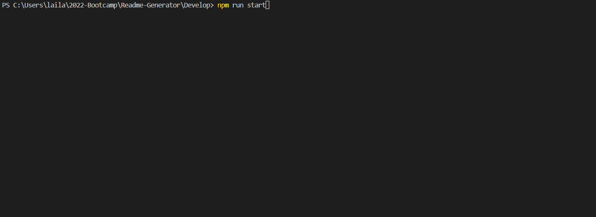

# Good Readme Generator

# Live URL 

https://sajjazaidi2015.github.io/Readme-Generator/
  
# Description

A user is prompted for their github username and is asked a series of questions. The answers populate a README generated for future projects.

## Demo

